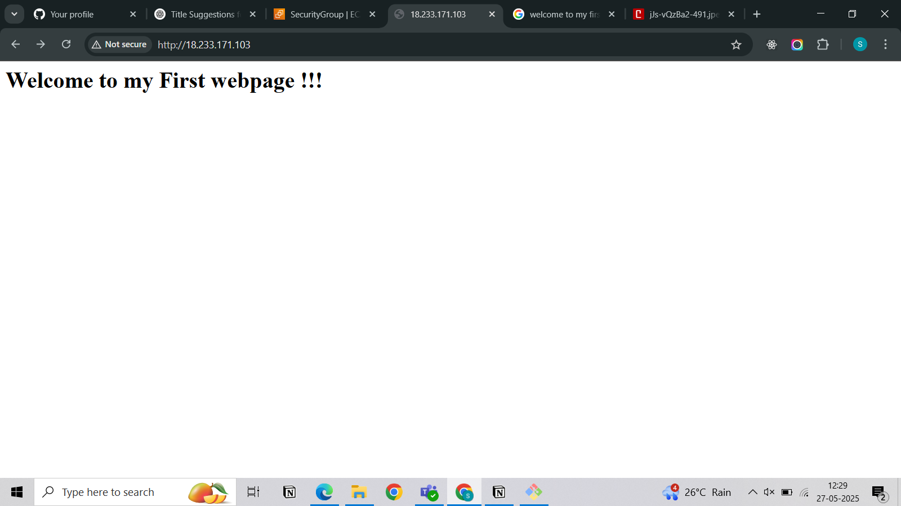

# 🚀 Deploying a Static Web Application using Amazon Linux EC2

## 📌 Project Overview
In this project, we deploy a **simple static web application** on an EC2 instance running **Amazon Linux**. This is a beginner-friendly guide to understand how web servers work on AWS.

---

## 🌐 What is a Web Server?
A **web server** is software or hardware that delivers web content to users over the internet. It handles incoming requests via **HTTP** or **HTTPS** protocols.

🔍 **How it works:**
- You enter a URL in your browser.
- The browser sends a request to the web server.
- The server finds the file (like `index.html`) and sends it back to your browser.


---

## 🧩 Steps to Deploy

### ✅ 1. Launch an EC2 Instance
- Go to **AWS EC2 Console**
- Click on **Launch Instance**
- Choose **Amazon Linux AMI**
- Select instance type: `t2.micro` (Free Tier eligible)
- Configure security group:
  - ✅ Allow **HTTP (80)** and **HTTPS (443)**
  - ✅ Allow **SSH (22)** for remote access
- Select or create a key pair
- Click **Launch**

### ✅ 2. Connect to your EC2 Instance
```bash
ssh -i pem-server-key.pem ec2-user@<Your-Public-IP>
```

### ✅ 3. Update System Packages
```bash
sudo yum update -y
```

### ✅ 4. Search for Apache (httpd)
```bash
sudo yum search apache
```

### ✅ 5. Install Apache Web Server
```bash
sudo yum install httpd -y
```

### ✅ 6. Check Apache Service Status
```bash
sudo systemctl status httpd
```

### ✅ 7. Start Apache
```bash
sudo systemctl start httpd
```

### ✅ 8. Enable Apache on Boot
```bash
sudo systemctl enable httpd
```

### ✅ 9. Navigate to Web Directory
```bash
cd /var/www/html/
```

### ✅ 10. Create Your Web Page
```bash
sudo vim index.html
```
📄 Add the following content:
```html
<!DOCTYPE html>
<html>
<head>
    <title>My First Webpage</title>
</head>
<body>
    <h1>Welcome to my first webpage!!!</h1>
</body>
</html>
```

### ✅ 11. Test Locally
```bash
curl localhost
```

### ✅ 12. View on Browser
- Open your EC2 **Public IP** in a browser:
```
http://<Your-Public-IP>
```
- You should see the webpage output.

📸 **Expected Output:**


---

## 🏁 Conclusion
I have successfully deployed a basic static website using **Apache Web Server** on an **Amazon Linux EC2 Instance**.

🎯 This project is perfect for understanding:
- Basic EC2 setup
- Installing and managing Apache server
- Hosting static content from a Linux server

---

🔐 **Pro Tip:** Remember to keep your `.pem` key file secure and never share it publicly.
